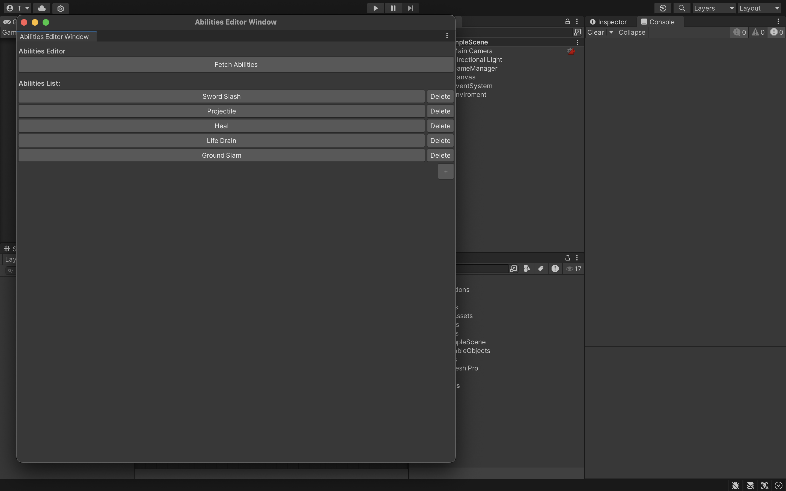
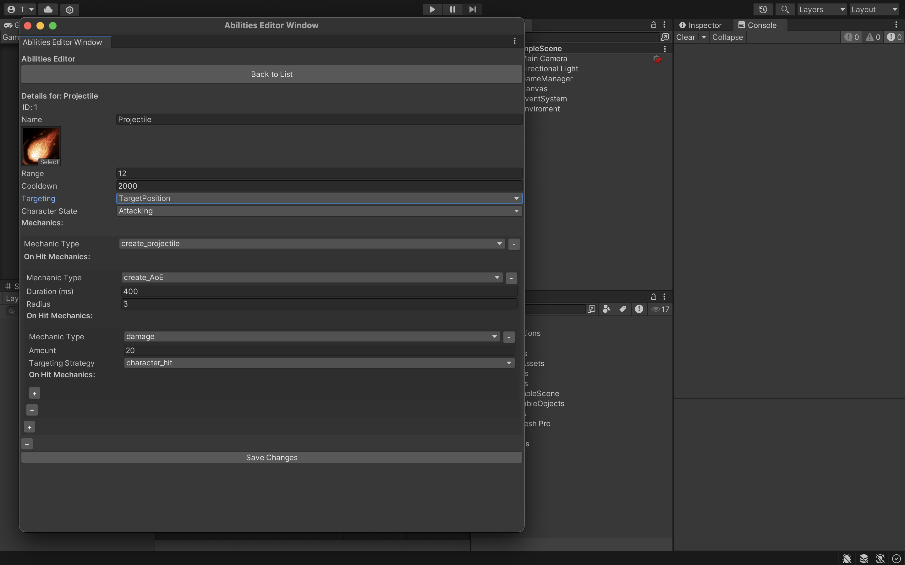
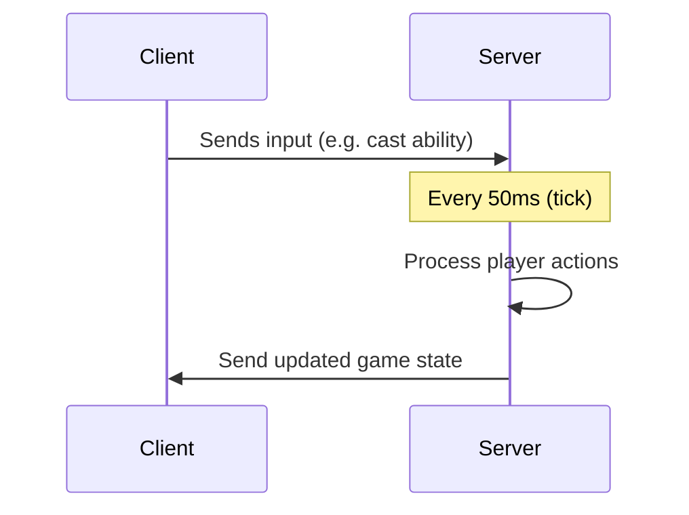

Copyright (C) 2025 Theo Katz

This program is free software: you can redistribute it and/or modify
it under the terms of the GNU General Public License as published by
the Free Software Foundation, either version 3 of the License, or
(at your option) any later version.

This program is distributed in the hope that it will be useful,
but WITHOUT ANY WARRANTY; without even the implied warranty of
MERCHANTABILITY or FITNESS FOR A PARTICULAR PURPOSE.  See the
GNU General Public License for more details.

# Untitled MMORPG Framework

This is a personal project I’m working on — a framework for building MMORPGs.

There are two goals for the project:
1. Make combat actually fun (think MOBA-style responsiveness and pace), while still having all the classic RPG systems: skills, dungeons, missions, etc. Inspired by *Argentum* and my frustration with how stale MMORPG combat tends to be.
2. Configurable so anyone can make their own version, being able to mold abilities, enemies, art, missions, map, etc. as they wish.

It’s still early in development, and I’m building it both to learn and as a future portfolio piece.

If you’re curious or have ideas, feel free to reach out.

## What it is (so far)

- A Unity client and a Go backend
- Real-time multiplayer with backend-authoritative logic (will change to UDP eventually, but WS where easier to use to prototype)
- A configurable system for skills (check it out in the client: `Window > Abilities Editor Window`)
- Combat mechanics, you can cast abilities with different mechanics you can customize.
- Simple NPC skeleton enemy to try things.
- Very basic inventory system, skeletons drop leather (useless) and health potions when killed.
- Also very basic collision system.
- There isn't pathfinding, but when you hit an obstacle your character stops moving, that's something.

## Not done yet

- Equipment system
- Move to UDP instead of WS for the server communication
- Quest/missions and dungeons
- Users with authentication and characters related to those users
- Persistence
- Pathfinding
- PvP rulesets
- A name
- Economy, allowing trade between players and with NPCs
- Deepen the abilities and inventory systems
- Not placeholder visuals
- Sound
- You can check out everything I would like to add eventually in the issues section of the github project

## Getting it running

Requirements:
- Unity `2022.3.53f1`
- Go `1.23.4`

How to run:
1. Start the backend:
   
       go run ./backend/main.go

2. Open the Unity project and press Play.

## How It Works

### Ability System

Accessible through `Window > Abilities Editor Window` in the Unity editor.

This window shows all currently defined abilities in your version of the game. Some come preloaded. You can edit, duplicate, or create new ones.

The first ability, `Sword Slash`, is used by the placeholder NPCs — those skeletons you can hit. Right now, if you edit or delete that ability, the game will break. The rest of the abilities are automatically assigned to the player, but note: **you can’t have more than 4 abilities assigned to the player** (5 in total if you count the enemy one). If you exceed that, the game also breaks. Click on any ability to edit it.

In the ability editor, you can tweak basics like:

- Name
- UI icon
- Cooldown
- Range
- Character state (as for now it's just the animation the character plays on the client when casting the skill).
- Targeting, this defines if the skill need another character as an objective or it it can be caster to any coordinate of the map.

But the core of the system is in the **mechanics**. These are the effects each ability applies to the game state — like dealing damage, healing, creating projectiles, or delaying another effect. Every ability is made up of one or more of these mechanics, and they can be reordered. Some even trigger other mechanics.

Mechanics aren’t exclusive to abilities either. For example, health potions dropped by enemies use the same "health variation" mechanic that healing or damaging abilities use.

---

Currently implemented mechanics:

- **Health Variation** (damage/heal)
- **Projectile Creation**
- **Area-of-Effect Creation (AoE)**
- **Delay** (wait before triggering next mechanic)

You can see how these are defined and registered in the backend, in the `mechanics.go` and `game_state.go` files.

There are a bunch of other mechanics I’d like to add eventually — but that’s a rabbit hole I’m avoiding for now. Same with projectiles: there are tons of possible variations, but I’m keeping it simple at this stage to focus on other parts of the framework.

### Networking

When the game starts, each player is automatically connected to the server.

The flow is pretty straightforward:

- The client sends input (like movement or casting an ability) to the backend.
- The backend updates the character's intended action.
- Every 50ms (as defined in `native_server.go`), the server processes a **tick**:
  - All characters attempt to execute their current actions.
  - Completed actions are removed; others are retained.
  - The updated game state is sent back to all connected clients.

#### Sending Only What Changed (Diffs)

Right now, the full game state is sent to all clients on every tick. This works for now, but it's not very efficient — especially as the number of players or objects grows.

We’ve already implemented **diff-based updates** for some systems (like the inventory), and the goal is to expand this to the rest of the game state.

**Why use diffs?**

- 🔽 **Reduces bandwidth**: Only sends what actually changed.
- ⚡ **Faster syncing**: Less data = less time to transmit and process.
- 📈 **Scales better**: More players and more world objects without crushing the network.

As the framework grows, diffs will become essential to keep things smooth, especially in fast-paced real-time combat.

## Attribution

This project uses free assets created by others. Huge thanks to the following creators:

- [**Magic Effects FREE** by Hovl Studio](https://assetstore.unity.com/packages/vfx/particles/spells/magic-effects-free-247933)
  Licensed under Standard Unity Asset Store End User License Agreement

- [**Dungeon Skeletons Demo** by Polygon Blacksmith](https://assetstore.unity.com/packages/3d/characters/creatures/dungeon-skeletons-demo-71087)
  Licensed under Standard Unity Asset Store End User License Agreement

- [**Basic RPG Icons** by PONETI](https://assetstore.unity.com/packages/2d/gui/icons/basic-rpg-icons-181301)
  Licensed under Standard Unity Asset Store End User License Agreement

- [**FREE - Modular Character - Fantasy RPG Human Male** by Blink](https://assetstore.unity.com/packages/3d/characters/humanoids/humans/free-modular-character-fantasy-rpg-human-male-228952)
  Licensed under Standard Unity Asset Store End User License Agreement

If you're one of the creators and want your asset removed or credited differently, feel free to reach out.

## License

MIT (or your preferred license here)
